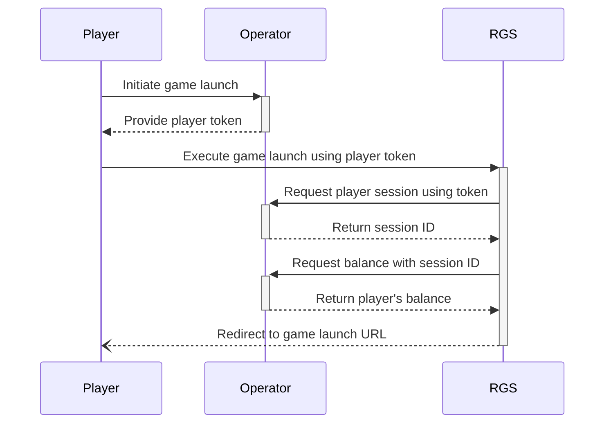
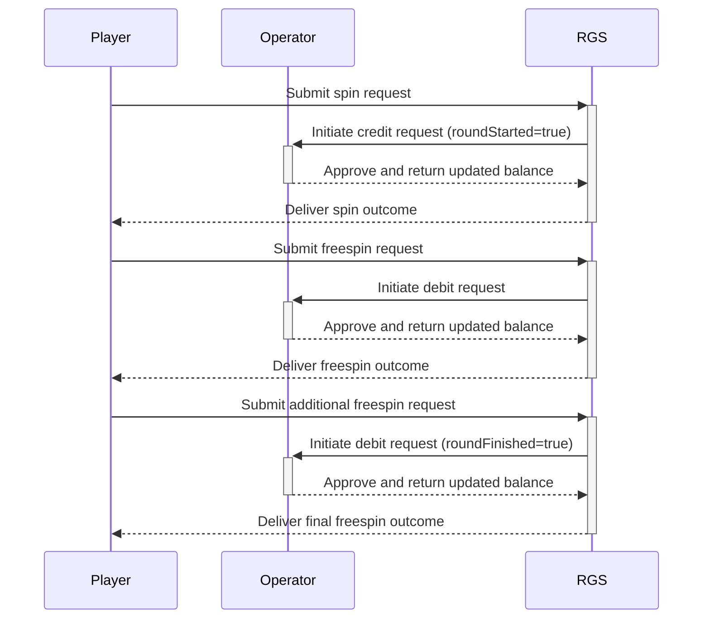

#### Key Terminology
- **RGS**: The central platform responsible for orchestrating game logic, determining bet outcomes, managing user accounts, and handling essential operational services.
- **Operator**: A gaming platform that hosts and offers casino games to end-users.
- **Player**: The individual who engages in the casino games.
- **Round**: A single session or iteration of gameplay within a specific casino game.

With these definitions in mind, the following sequence diagrams provide a detailed look at the core operational flows within the RGS ecosystem. They illustrate how players, operators, and the RGS platform interact to launch games and conduct game rounds seamlessly.

## Sequence Diagram for Game Launch

## Sequence Diagram for Game Round

