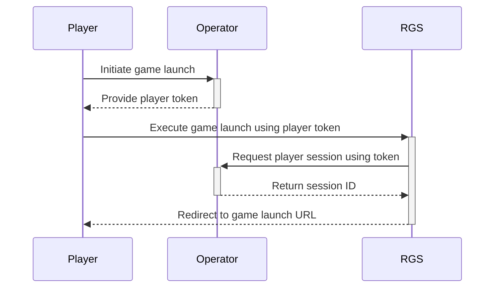
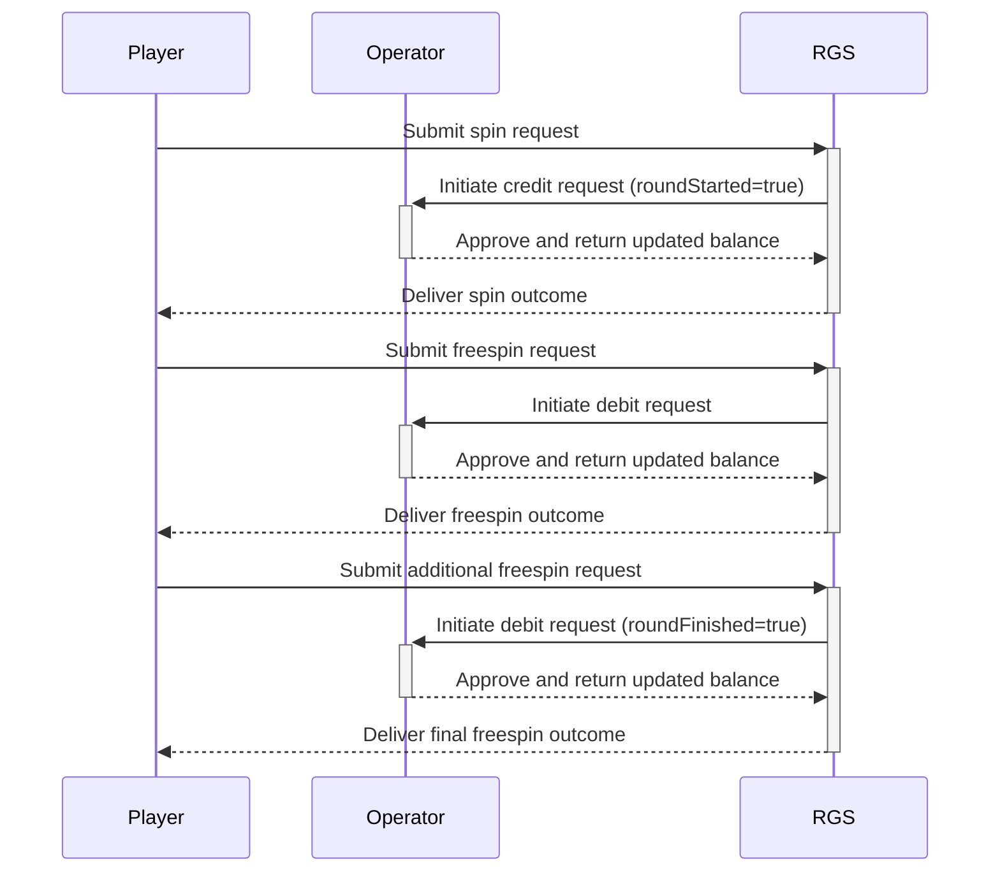

## API Endpoints

This section outlines the primary API endpoints used in the RGS system:

### 1. Get Player Session
- **Endpoint:** `GET /session`
- **Description:**
Initiates a player game session using a provided player token and game UUID. Returns a unique player ID, session ID, and the currency code associated with the player's account.

### 2. Get Balance
- **Endpoint:** `GET /balance`
- **Description:**
Retrieves the current balance for a player based on their unique player ID, session ID, game UUID, and currency code.

### 3. Credit
- **Endpoint:** `POST /credit`
- **Description:**
Adds a specified amount to the player's balance as part of a game transaction.
**Idempotency:** This operation is idempotent, meaning that repeated requests with the same `transactionId` will not result in additional credits beyond the first successful request.

### 4. Debit
- **Endpoint:** `POST /debit`
- **Description:**
Debits a specified amount from the player's balance as part of a game transaction.
**Idempotency:** This endpoint is designed to be idempotent, ensuring that if the same debit request (identified by its `transactionId`) is submitted more than once, only one debit is applied.

### 5. Rollback
- **Endpoint:** `POST /credit/rollback`
- **Description:**
Reverses a previously credited amount from the player's balance, effectively rolling back a wager.
**Idempotency:** This operation is idempotent so that multiple requests with the same `transactionId` do not result in multiple rollbacks.

---

With these definitions in mind, the following sequence diagrams provide a detailed look at the core operational flows within the RGS ecosystem. They illustrate how players, operators, and the RGS platform interact to launch games and conduct game rounds seamlessly.

## Sequence Diagram for Game Launch

## Sequence Diagram for Game Round

---

## Idempotency in the RGS API

Idempotency is a critical concept for ensuring the reliability and consistency of transaction processing. In the context of the RGS API, idempotency means that:

- **Definition:**
An operation is idempotent if performing it multiple times yields the same result as executing it once. This prevents duplicate transactions from affecting the player's balance.

- **How It Works:**
Each transaction-based request (for credit, debit, or rollback) includes a unique `transactionId`. The system uses this identifier to track whether a transaction has already been processed. If a duplicate request is received with the same `transactionId`, the system will recognize it and return the same response as the initial request, without reapplying the transaction.

- **Benefits:**
- **Consistency:** Ensures that network retries or duplicate submissions do not cause unintended balance changes.
- **Reliability:** Provides a safeguard against errors and minimizes the risk of double processing, which is vital in financial transactions.

---
